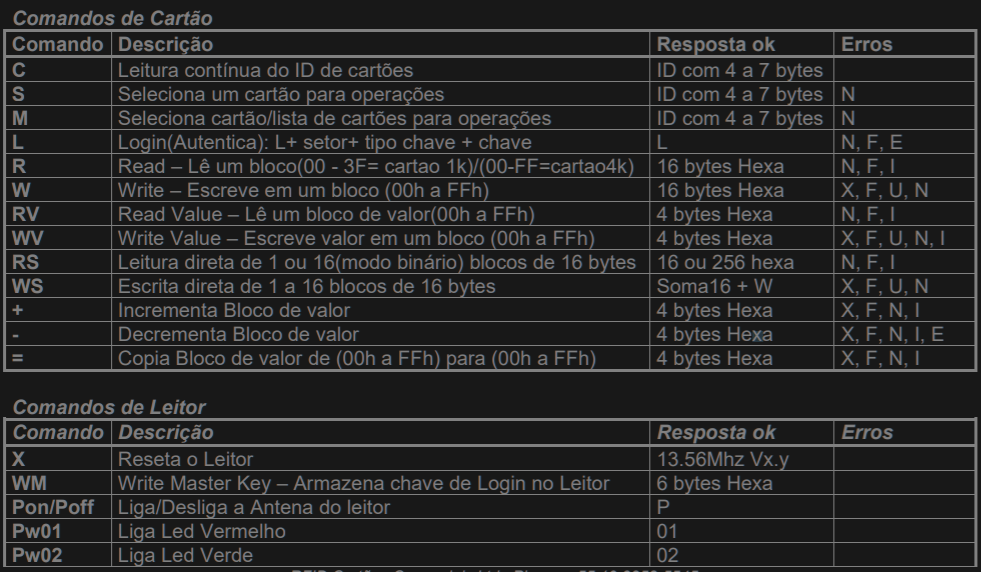
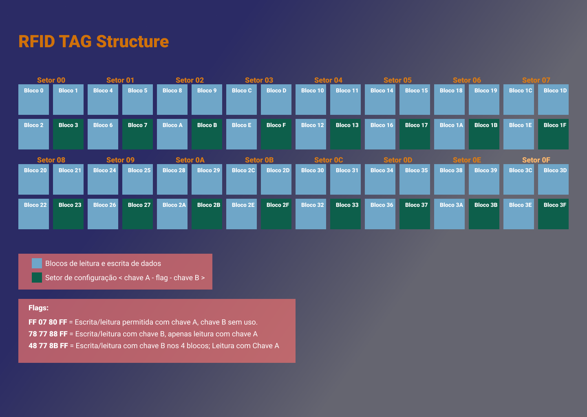
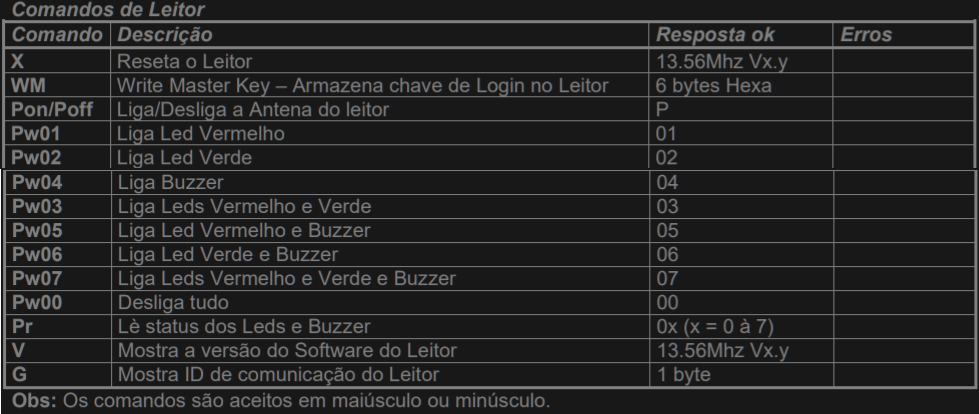
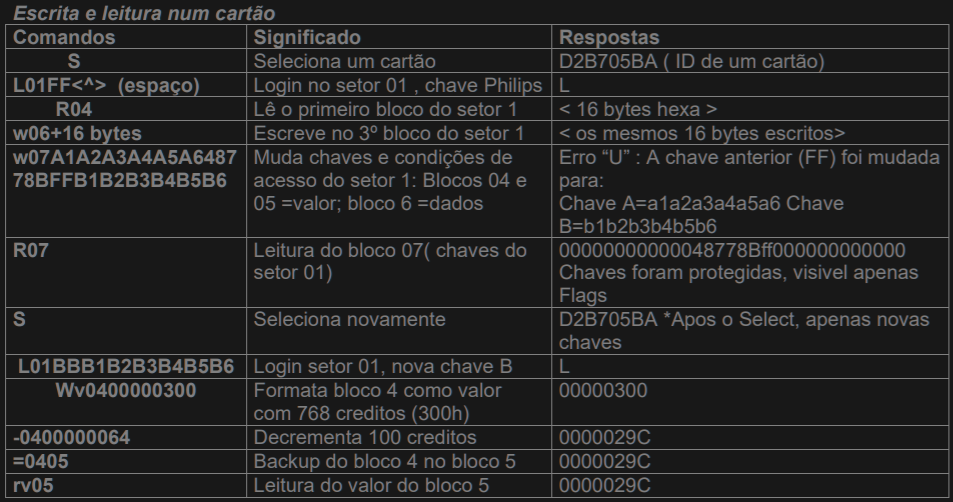
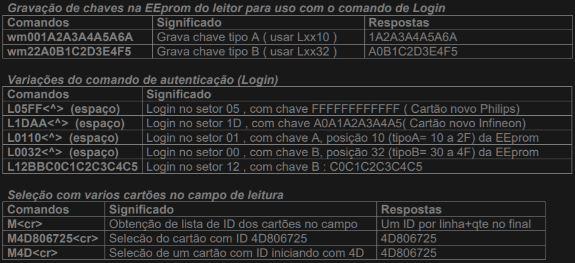

# RFIDCartao
<i>Uma API baseada em RFID (Radio Frequency Identification) utilizando a interface de comunicação 
Serial do tipo RS232 para leitura e escrita em TAG's (cartões inteligentes)</i>

## Planejamento

- [ ]  Bootstrap
    - [ ] CheckPorts
    - [ ] EstabilishCommunication
    - [ ] ResetRFIDReader
    - [ ] ConfigRFIDReader
    
- [ ] GetAction
    - [ ] IOConfig
    - [ ] Read
    - [ ] Write
    - [ ] teste
    
- [ ] ASCIIHexaConversor
- [ ] ResetCard
- [ ] SoundSignal
- [ ] CardMapper
- [ ] BigEndian/LittleEndian

## Especificações

<i>O leitor e gravador para cartões 13.56MHz, ISO 14443A, RF-CLASSIC é destinado
aos Integradores de Moedeiros Eletrônicos, Validadores de Transações e
aplicações complexas.</i>

#### Versão do Modelo: 
<b>13.56Mhz V2.1-A - INELTEC</b>

#### Documentação oficial:
<i>http://www.autotag.com.br/produtos/RFIDCC/DOC/Leitores%20Mifare/RF-Classic.pdf</i>

## Agentes

### Eeprom (Eletrically Erasable Programmable Read-Only Memory)

Chip da Eemprom RFIDCC (Tecnologia Brasileira) = <b>MXT - MS50</b>
São 16 setores com 16 bytes cada. Dependendo de onde o byte ativo estará, alteramos e configuramos 
a Eeprom.

* 00 à 03 - Read only
* 04 - Comunicação Binária

* 05 - bit 1 = modo contínuo(ASCII) | bit 2 = modo binário | bit 3 = null | bit 4 = Timeout binário
  > Modo Contínuo: Válido apenas em modo ASCII (não Binário). Se em 1: Transmite contínuamente o nro
  serial do um cartão de proximidade presente no campo do leitor.
  Modo Binário: em 1: Comunicação em modo binario.
  Timeout Binário: em 1: Espera de no máximo 100ms pelo ETX em modo binário.
  Para o comando WS (escrita de 256 bytes), o timeout é de 300ms.
  
* 06 - Baud Rate / bit 0 = 9600
> Valores de Baud Rate: 000 =9600 ; 001=19200 ; 010=57600 ; 011=115200, 100=38400.

* 07 à 0F - Livre

### Observação:
> Para acessar a eeprom de configuração são usados os comandos “RE” e “WE”.
Exemplo para lêr a posição 04 (ID): RE04
Exemplo para escrever o valor “03” na posição 04: WE0403<cr>
O comando “WE” deve ser terminado com o caracter <cr> para diferenciar de escrita no bloco E0 de
cartão.
Em modo binário o comando “WE” é aceito com ou sem <cr>

### Comandos Eeprom (Cartão)

> Exemplo de flag: "FF 07 80 FF";
> Tipo de chave: 10 = 16bits(chave A) ou 32 = 64bits(chave B);

### TAG 13.56MHz (Cartão Inteligente)

Tem capacidade de 1MB sendo 16 setores com 4 blocos cada um.
Cada Bloco possui espaço de 16 bytes, ou 16 caracteres ASCII, ou 32 caracteres Hexadecimais.
No Ultimo bloco de cada setor é onde se encontra a interface de configuração de leitura/escrita.
O Ultimo bloco de cada setor é composto de: 

* 6 primeiros bytes --> chave A;
* 4 bytes seguintes --> flag de Acesso;
* 6 ultimos bytes   --> chave B;

#### Resumo da estrutura de um Cartão 13.56Mhz:
* Cartão de 1k bytes:São 16 Setores ( 00 a 0F) com 4 blocos de 16 bytes
* Cartão de 4k bytes:São 32 Setores(00 a 1F) com 4 blocos de 16 bytes + 7 setores com 16 blocos de 16
bytes

> O ultimo bloco de cada setor contem: <6 bytes=chave A> <4 bytes=flags> <6 bytes=chave B>

#### Exemplos de Flags:
* FF 07 80 FF = Escrita/leitura permitida com chave A, chave B sem uso.
* 78 77 88 FF = Escrita/leitura com chave B, apenas leitura com chave A
* 48 77 8B FF = Escrita/leitura com chave B nos 4 blocos; Leitura com Chave A

> Apenas decrementos de valor com chave A nos dois primeiros blocos

### Comandos de Leitor

### Significado das Respostas com Erro:

<b>N</b> – Sem cartão no campo do leitor;

<b>F</b> – Falha na operação;

<b>E</b> – Chave interna inválida para Login( armazenada pelo comando WM);

<b>I</b> – Tentativa operação com valor em campo não configurado;

<b>X</b> – Sem leitura após escrita;

<b>U</b> – Leitura após escrita não confere;

<b>E</b> – Falha em decremento( valor a decrementar inferior ao crédito);

<b>?</b> – Comando não reconhecido;

### Exemplos de uso dos Comandos

### Login e autenticação

### Comandos Macro

Os comando especiais RS e WS são usados para realizar leituras/escritas de 1 a 16 blocos de 16 bytes,
com as operações e Seleção de cartão e Login( autenticação) em setor, fazendo parte do mesmo comando.

#### Comando de Leitura
Realiza a leitura de 256 bytes ( apenas 16 bytes em modo ASCII) de blocos de dados de um cartão. Os
blocos de fim de setor(chaves e flags) não são inclusos na resposta.
Todos os setores devem ter a mesma chave de autenticação, que deve ser gravada em uma posição da
eeprom (comando WM). Se for encontrado algum setor com chave diferente, a resposta é enviada apenas
até aquele ponto, seguindo-se o código de erro e os números do setor e bloco onde foi realizado a última
leitura.

Para apenas um cartão presente no campo de leitura: RSSxxcc
Para vários cartões presentes no campo de leitura: RSMxxcchhhhhhhh, onde:

* xx = bloco inicial do cartão
* cc = posição na memória de autenticação: chave tipo A= 10 a 2F; chave tipo B= 30 a 4F
* hhhhhhhh = ID de um dos cartões presentes no campo de leitura.

Os códigos de erro são os mesmos dos comandos individuais de Login,Seleção e leitura de bloco.
Para uma leitura sem erro, no final dos bytes enviados é enviado a letra “R” seguida dos números do ultimo
setor e bloco presente na resposta.

#### Comando de Escrita

Realiza a escrita de 16 a 256 bytes ( apenas 16 em modo ASCII) de blocos de dados de um cartão. Os
blocos de fim de setor(chaves e flags) são saltados na operação.
Todos os setores devem ter a mesma chave de autenticação, que deve ser gravada em uma posição da
eeprom (comando WM). Se for encontrado algum setor com chave diferente, o comando retorna um código
de erro, informando, logo após, o último setor e bloco onde foi realizada escrita.

## Do Projeto

1) Verificar se a Eeprom está conectada à porta.
2) Resetar Eeprom
3) Configurar parâmetros da comunicação sr232 na leitora
4) Perguntar que tipo de operação será realizada (leitura, escrita, login, reset)
5) Montar as queries baseado no tipo de dado que será gravado (nome, telefone, id, etc)